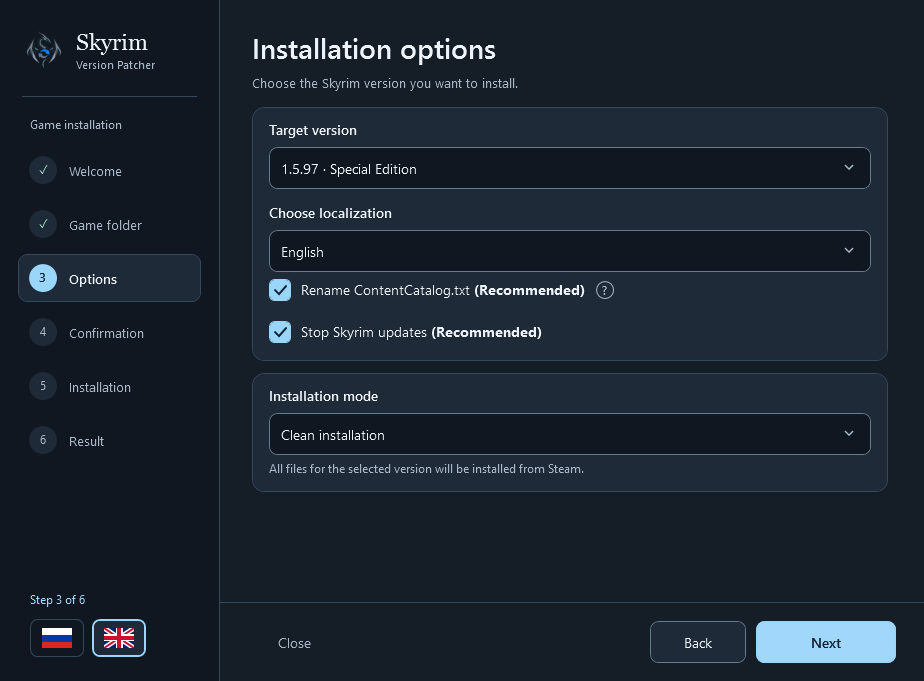

<div align="center">
  

  <h1>Skyrim Version Patcher</h1>
  <p><strong>The right Skyrim version for your mod setup.</strong></p>
  <p>Install Skyrim SE 1.5.97 or AE 1.6.1170 using Steam or local depot files.</p>

  <p>
    
    
    <a href="LICENSE"></a>
  </p>

  <p>
    <a href="#quick-start">Quick start</a> ·
    <a href="#building-from-source">Build from source</a> ·
    <a href="https://github.com/Escan0re/SkyrimVersionPatcher/issues">Report an issue</a>
  </p>
</div>

---

**Skyrim Version Patcher** is a Windows app with a step-by-step wizard for installing two widely used versions of Steam Skyrim. Choose your game folder, target version and language; the app prepares a complete file set, verifies it and installs it into your selected copy of Skyrim.

Use it to prepare your game for a specific mod setup, return to **1.5.97**, or install **1.6.1170**. Game files are obtained through your Steam client or supplied as local depots.



## Features

- **Two target versions:** Skyrim Special Edition **1.5.97** and Anniversary Edition **1.6.1170**.
- **Two file sources:** a fresh Steam download or your own verifiable local depot files.
- **Nine game languages**, with an independently switchable English / Russian interface.
- **Checks before installation:** file inventory, sizes, hashes and the prepared executable's version.
- **Compatibility options:** rename an incompatible `ContentCatalog.txt` and protect the Steam app manifest from writes.
- **Separate game copies:** select an existing installation in another folder.
- **One executable to launch:** packaged builds include .NET, so users do not need to install it separately.

## Quick start

1. Obtain `SkyrimVersionPatcher.exe` from a packaged build, or [build it from source](#building-from-source).
2. Close Skyrim, its launcher and SKSE. For Steam downloads, open Steam and sign in to an account with access to Skyrim Special Edition.
3. Launch the patcher and select an existing Skyrim folder containing `SkyrimSE.exe` and the base game data.
4. Choose **1.5.97** or **1.6.1170**, your game language and the file source.
5. Review the settings, click **Install**, and wait for the result.

Requires **Windows 10/11 x64**, write access to the selected folder and enough free disk space. Downloading a complete file set may require tens of gigabytes. Supported editions are **Steam Skyrim SE/AE** (App ID `489830`). GOG, Microsoft Store, Legendary Edition and Skyrim VR are unsupported.

## Installation modes

| Mode | Choose it when | What the patcher does |
| --- | --- | --- |
| **Clean installation** | You need the complete target version from Steam | Downloads all required depots again through your installed Steam client, verifies the files and installs them into the game folder. |
| **I already have depot files** | You already have the complete set for the selected version and language | Verifies and installs local files without a network download. An incomplete or mismatched set stops the operation before any game files are changed. |

A **depot** is a package of game files that Steam downloads to `steamapps/content/app_489830/depot_<id>`. For local installation, select `steamapps/content`, `app_489830`, a folder containing `depot_<id>` directories, or an exported verified patcher cache.

Ordinary depots require matching public `<depot>_<manifest>.manifest` files in the selected folder, its `depotcache`, or your installed Steam client's depotcache. If a manifest is missing, the patcher shows its exact filename. Keep the depot folder separate from the game folder. Original local depot files are left unchanged.

## Languages

**Interface:** English and Russian. Use the flags in the lower-left corner to switch independently of the game language.

**Game:** English · Français · Italiano · Deutsch · Español · Polski · Русский · 繁體中文 · 日本語.

On first launch, the game language follows your Windows language when supported; otherwise it defaults to English. Your choice is saved. Existing profile INI files are updated for the selected language and official voice archive.

## Important installation behavior

> **Make your own backup before installing.** The patcher does not back up game files or settings and does not perform automatic rollback.

- **Clean installation replaces the entire selected file set.** Before writing, it removes files with matching filenames throughout the selected Skyrim folder, including subfolders. This can affect mod files with the same names. Other files remain in place.
- **Interrupted file writes** may leave a partially installed game. Repeat the installation of your chosen version to finish. Cancelling the patcher's wait does not cancel a download already running in Steam.
- **Separate game folders usually share the Windows profile:** saves, INI files and `ContentCatalog.txt`. The patcher does not create independent profiles.
- **Match SKSE, DLL mods and Address Library** to the installed version. The paid Anniversary Upgrade is not downloaded separately.

Both compatibility options are enabled by default:

| Option | Behavior |
| --- | --- |
| **Rename ContentCatalog.txt** | Renames a detected incompatible catalog to `ContentCatalog.bak`. An existing backup is never overwritten; a conflicting backup stops the installation before game files are changed. |
| **Stop Skyrim updates** | Sets `appmanifest_489830.acf` to read-only after a successful installation. To allow updates again, remove that file attribute manually. Unchecking the option does not remove an existing read-only attribute. |

## Working with Steam

Downloads are handled by **your installed Steam client**, using its current signed-in account. The patcher does not ask for your password or Steam Guard code, read saved credentials, or create a separate authenticated session.

The patcher prepares Steam Console and submits download commands. It does not shut down or restart Steam. Steam may come to the foreground during automated input. Both apps must run under the same Windows user with the same privilege level; automation availability depends on the Steam client version.

Settings, working data and diagnostic logs are stored in `%LOCALAPPDATA%\SkyrimVersionPatcher`. See [data/SOURCES.md](data/SOURCES.md) for catalog sources. Game files are not bundled with this project.

## Building from source

You need **Windows**, **.NET SDK 10**, and [NSIS 3](https://nsis.sourceforge.io/Download) to package a single executable. Add `makensis.exe` to `PATH` or place it at `.tools/nsis/makensis.exe`. The project uses no external NuGet packages.

```powershell
git clone https://github.com/Escan0re/SkyrimVersionPatcher.git
cd SkyrimVersionPatcher
dotnet build SkyrimVersionPatcher.slnx -c Release
dotnet run --project tests/SkyrimVersionPatcher.Tests -c Release --no-build
dotnet run --project tests/SkyrimVersionPatcher.UiTests -c Release --no-build
powershell -ExecutionPolicy Bypass -File scripts/publish.ps1
```

The publishing script also builds the solution and runs both test suites. Output: `artifacts/SkyrimVersionPatcher-single-exe-win-x64/SkyrimVersionPatcher.exe`. On launch, support files, .NET and documentation are extracted to `%LOCALAPPDATA%\SkyrimVersionPatcher\App\<build hash>`.

Automated tests use temporary files and a simulated Steam bridge. They do not install the game or confirm complete live downloads or compatibility with every mod.

## Feedback

Found a problem? [Open an issue](https://github.com/Escan0re/SkyrimVersionPatcher/issues) with your target Skyrim version, game language, installation mode and the exact error message. Remove personal paths and account details before sharing logs.

## License and author

**Author:** [Escan0re](https://github.com/Escan0re).

Copyright (C) 2026 Escan0re. The source code is licensed under the **GNU General Public License v3.0** (`GPL-3.0-only`), without warranty. Read the full text in [LICENSE](LICENSE). Independent third-party components retain their own licenses; see [THIRD-PARTY-NOTICES.md](THIRD-PARTY-NOTICES.md).

Skyrim and Steam belong to their respective owners. This project is not an official Bethesda or Valve product.
